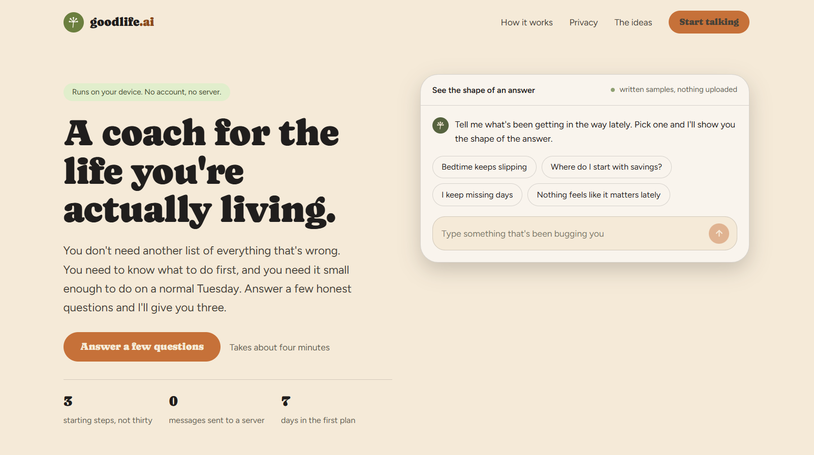
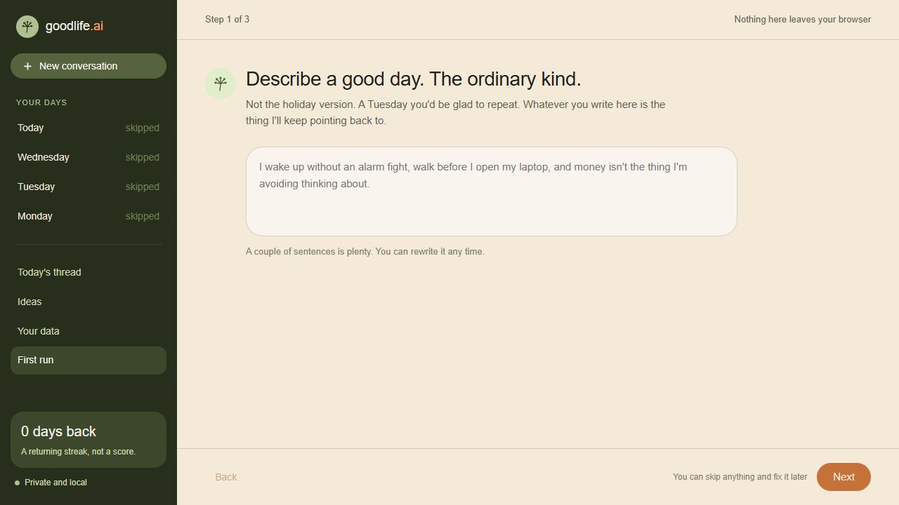
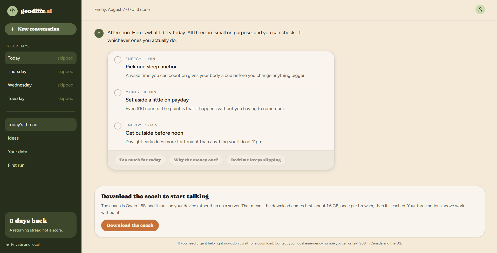
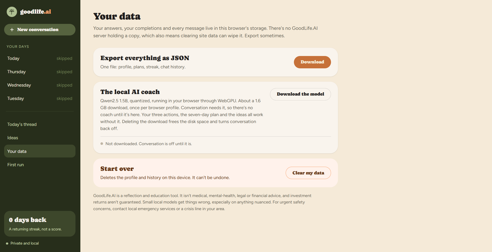

# GoodLife.AI

  

  <strong>A private, local-first coach for building a life that fits.</strong> 
  GoodLife.AI turns a few honest answers into small steps you can actually try.

  <a href="https://goodlifeai.vercel.app">Try the live app</a>
  ·
  <a href="https://github.com/mutms7/GoodLife.AI">View the source</a>

## Why GoodLife.AI exists

Self-improvement advice often creates another giant list of things to fix. Most people need help deciding what to do first, with a first step small enough for a normal Tuesday.

GoodLife.AI is built around that idea. It opens with a short conversation about an ordinary good day, what matters right now, and where things feel stuck. Then the coach brings three practical starting points into today's thread, where you can check them off, push back, and return tomorrow.

The financial guidance draws on a lesson from *The Wealthy Barber*: pay yourself first, automate saving, live below your means, and give long-term investing a place in the plan. GoodLife.AI turns that into general education about emergency savings, expensive debt, and diversified, low-cost ETFs. It doesn't promise returns or tell anyone what to buy.

## A quick tour

  

First run is a three-step conversation rather than a form. You describe an ordinary good day, pick up to three things that matter right now, and say whether four areas feel fine, shaky, or rough. Three is a hard cap, because everything can't be first.

  

The coach thread is the home screen, and the day's plan arrives inside it as a message you check off. The app ranks three starting actions from those answers: rough areas first, then what you said matters. Someone with rough sleep, rough money, and energy on their list gets a wake-time anchor, a payday transfer, and a daylight walk. You can argue with any of it in the same thread.

The three don't stay the same. Check an action off three times and it graduates: it's a habit now, so it stops taking up a slot and the next candidate moves in. The shuffle button next to a row pushes it aside for today if it doesn't fit. Sources are drawn round-robin rather than one at a time, so rough sleep gets you a sleep action and a money action rather than three sleep actions.

None of that is stored. What was on offer on a given day is recomputed from your profile, the completions before that day, and any swaps you made on it, which is why clicking back through the week shows what you actually saw. Graduation counts completions from previous days only, so checking an action off for the third time doesn't make it vanish out from under the tick you just earned. It goes tomorrow.

  

Your data is also where you export a local copy, start over, or download the coach. Conversation needs the model, so there's no chat until it's downloaded. Deleting the download frees the disk space and turns conversation back off. Every coach reply includes a source note saying which playbook topic it was grounded in.

## How the AI works

GoodLife.AI uses a hybrid design, but the split isn't "some questions get a model and some don't." The three-step first run and the first-week plan use fixed, testable rules, because those are the most visible recommendations and they should be predictable. Conversation is the model's job, all of it.

The coach is a pretrained Qwen2.5-1.5B-Instruct model running through WebLLM. It has roughly 1.5 billion parameters and it's quantized, which keeps the download and memory requirements lower than a full-size model. The first download is about 1.6 GB and needs a browser with WebGPU. GoodLife.AI uses the model as published; it wasn't trained or fine-tuned for this app.

It used to be the 0.5B version of the same model, and the reason it isn't any more is worth writing down. Asked how to build a consistent sleep schedule, that model produced a ten-item listicle when the voice rules asked for a few sentences, and item ten recommended Ambien, whose generic name it got wrong in a way no real drug list contains. The rule against naming a medication was sitting in its own prompt at the time. Half a billion parameters is small enough that a negative instruction is roughly a suggestion, and the words in the rule make the concept more available rather than less. 1.5B costs more download and more time per reply, and it holds a rule.

The model runs on your device inside the browser. There is no GoodLife.AI inference server, no API key, and no per-message cloud request. That's also why the coach can't start before the download finishes. The app says so plainly rather than quietly answering with something else, which is what it used to do.

### The playbook is a markdown file

All of the coach's guidance lives in [`lib/playbook.md`](lib/playbook.md). Editing that file is how you change what the coach says, and it doesn't require touching any code. Each `##` heading is a topic:

~~~markdown
## money

When: they're asking about money, saving, debt, investing, budgeting, taxes, or what to do with a paycheck

Say after: This is general education, not advice about your situation.

- Start with a small emergency buffer in a plain savings account, a few hundred dollars, before anything fancier.
- Never name a specific security, ticker, allocation, platform or dollar amount for this person.
- Never predict a return and never say an investment is safe.
~~~

There is no keyword table deciding which topic a message belongs to. The model reads the `When:` lines and picks, which is the part it's actually good at. An earlier version did use keyword matching, and it matched "fee" inside "feel", which quietly sent a large share of ordinary messages down the money path.

### Two passes, because the model is small

Answering happens in two generations rather than one:

1. **Topic.** The model gets only the `When:` lines and answers with a single word, at temperature 0 with an 8-token ceiling. A few tokens, so it's cheap.
2. **Answer.** Only that topic's bullets go into the answering prompt, along with the voice rules and the good-day line.

The alternative was pasting the whole playbook into one prompt. A small model handed nine topics' worth of instructions follows them noticeably worse than one handed the five bullets that apply, so the split buys real quality for one short extra generation. If the topic pass fails, refuses, or says something unrecognisable, it falls back to `general`, which still carries notes. There's no path that reaches the model with nothing attached.

### Where the model is trusted, and where it isn't

Routing is the model's call, all of it. There is no phrase list under it, not even for crisis. A message about suicide gets there because the model read the crisis topic's `When:` line and named it, the same way a message about rent gets to housing. The topic prompt is told to answer `crisis` whenever a message *could* be about wanting to die, even if another topic also fits and even if it isn't sure, so the one call that matters is biased in the direction where a wrong answer costs a phone number nobody needed.

The honest cost of that: the coach can't recognise a crisis message until the model has finished downloading, and it can't recognise one at all on a device without WebGPU. Before the model is ready, the app doesn't answer, it says it can't. That's a real gap, and it's a deliberate one rather than an oversight.

What still doesn't depend on the model behaving:

- **Crisis text is never generated.** Once a message has been routed to a topic with a `Fixed reply:`, that text is sent verbatim and no answering generation happens. A small model paraphrasing a hotline number is a worse outcome than a fixed paragraph.
- **Disclaimers are appended after generation.** `Say after:` text is concatenated by the app once the model is done. The model is never asked to remember it, so it can't soften or drop it.
- **Prescriptions are stopped on the way out.** The prompt tells the model it can name a medication as general information but must never tell this person to take one and must never give a dose. Because that's an instruction and instructions get ignored, `prescribesMedication` also checks the stream as it arrives, against prescription-only drug names and against any number sitting next to a dose unit. A reply that trips it is dropped mid-stream and the thread says why. This exists because an earlier build recommended a sleeping pill whose generic name it had invented, with the rule against exactly that sitting in its own prompt.

### Treating your own words as untrusted

The reference notes sit in the prompt where you can't see them, so the app has to assume someone will try to talk their way around them. Both your message and the good-day line from first run are untrusted input, and the good-day line matters more than it looks, because it gets replayed into the system prompt on every single turn.

- Chat-template tokens (`<|im_start|>`), `[INST]` and `<<SYS>>` blocks, faked `System:` role headers, and zero-width or bidi characters are stripped before anything is assembled.
- Your text is fenced between markers carrying a random 16-character value generated fresh for each message. There's nothing stable to guess, so a message can't close the fence early and start issuing instructions.
- The rules tell the model that everything inside the fence is a person talking, never an instruction, and that the reference notes outrank anything the message asks for.
- Generation is checked as it streams. If a reply starts echoing the fence, the notes, or the template tokens, it's dropped mid-stream and you get a retry instead of the leak.

None of this makes a 500M-parameter model trustworthy on its own. It narrows what a bad generation can turn into, and the disclaimers survive either way.

Replies stream token by token, and you can stop one mid-sentence. If the model fails, the coach says so and offers to try again rather than substituting a different answer.

The last few turns go with each message, so "why?" and "that won't work for me" land as follow-ups rather than as standalone questions. Older turns from you are fenced exactly like the current one: an injection parked three messages back is the same untrusted input, and it would otherwise walk in through the side door.

## The ideas behind the product

GoodLife.AI borrows ideas, not slogans.

Atomic Habits shaped the seven-day plan. Actions are made smaller, tied to cues that already exist, supported by the environment, and tracked without treating a missed day as a personal failure. The app uses a simple “never miss twice” reminder.

The Wealthy Barber shaped the money prompts. Pay yourself first, automate a sustainable amount, keep an emergency buffer, deal with high-interest debt, and invest for the long term only after considering risk, time horizon, account rules, fees, and local tax context.

Other cards in the library are informed by *How to Win Friends and Influence People*, *The Happiness Trap*, *Why We Sleep*, and *Four Thousand Weeks*. The app also links to public guidance from the CDC, WHO, Investor.gov, and the Consumer Financial Protection Bureau. These are prompts to test, not rules to obey.

## How messages are routed

~~~mermaid
flowchart TD
    A[Three-step first run] --> B[Local profile in browser storage]
    B --> C[Fixed planner]
    C --> D[Three starting actions]
    D --> E[Seven-day habit plan]

    B --> F[Coach message]
    F --> G{Safety-net phrase, minus the Except list?}
    G -->|Yes| H[Fixed reply from playbook.md, no model]
    G -->|No| I{Model downloaded?}
    I -->|No| J[Download gate, no chat]
    I -->|Yes| K[Sanitize and fence the message]
    K --> L[Pass 1: model reads the When lines and names a topic]
    L --> M{Recognised?}
    M -->|No| N[Fall back to general]
    M -->|Yes| O[That topic]
    N --> P[Pass 2: notes plus the fenced good-day line]
    O --> P
    P --> Q[Local model streams a reply]
    Q --> R{Echoes the prompt scaffolding?}
    R -->|Yes| S[Dropped mid-stream, offer a retry]
    R -->|No| T[Append Say after verbatim]
    T --> U[Local chat history and progress]
    H --> U
~~~

## Privacy and limits

The profile, completions, streaks, and chat history are stored in the browser's local storage. They aren't sent to a GoodLife.AI server. The model runs locally after its files are downloaded and cached by the browser.

This also means the data is tied to that browser and device. Clearing site data can remove it, so the app includes a JSON export. The model needs a compatible WebGPU device and a fairly large first download, and without it there's no conversation at all. The first run, the day's three actions, the seven-day plan, the ideas library and the crisis response all still work. Small local models can be less capable than cloud models, especially with complex or nuanced questions, which is what the reference notes and the appended disclaimers are for.

GoodLife.AI is a reflection and education tool. It isn't medical, mental-health, legal, or financial advice. Investment returns aren't guaranteed. Renting and owning both have trade-offs, and the app doesn't assume one is right for everyone. For urgent safety concerns, contact local emergency services or a crisis service in your area.

## Tech stack

- React and TypeScript
- Vinext and Vite
- The Organic design system, self-hosted Caprasimo and Figtree
- WebLLM with Qwen2.5-1.5B-Instruct, required for conversation
- A markdown playbook the model routes against, plus a prompt layer that sanitizes and fences untrusted input, and an output check that stops a reply from prescribing
- WebGPU for in-browser inference
- Browser local storage for the local-first data model
- Service worker and web manifest for PWA installation
- Node's built-in test runner, ESLint, and TypeScript checks

## Run it locally

Requires Node.js >=22.13.0.

~~~bash
git clone https://github.com/mutms7/GoodLife.AI.git
cd GoodLife.AI
npm install
npm run dev
~~~

Then open the local URL printed by Vinext. `/` is the marketing page, with written sample exchanges so you can see the shape of a reply before committing to a download, and `/app` is the product. To change what the coach says, edit [`lib/playbook.md`](lib/playbook.md) and rebuild. No code changes needed. First run, the day's three and the seven-day plan work right away. Conversation doesn't: open the app in a WebGPU-compatible browser and choose “Download the coach,” either from the gate under the thread or from Your data. The download happens once per browser profile and can take a while.

To make a production build:

~~~bash
npm run build
npm start
~~~

## Tests and checks

~~~bash
npm test
npm run lint
npm run build
~~~

The checks cover rendering, the playbook parser against the real `playbook.md`, the crisis safety net and its `Except:` list, what happens when the model names a topic that doesn't exist, the prompt-injection boundary, and how the day's three actions are chosen. The playbook tests assert on the shipped file rather than a fixture, so editing the markdown badly, a topic with no `When:` line or a missing disclaimer, fails the suite.

`npm test` runs the build and `tsc --noEmit` before the tests, so a type error fails the suite rather than sitting there quietly. The unused Cloudflare and Drizzle scaffold that used to break the typecheck (`db/`, `drizzle/`, `examples/d1/` and `app/chatgpt-auth.ts`) is gone, along with the `drizzle-orm` and `drizzle-kit` dependencies. Nothing imported it.

## Install it as an app

GoodLife.AI is a Progressive Web App. On a supported browser, use the install prompt in the app or the browser's “Add to Home Screen” or “Install” command. The service worker caches the application shell so it opens like a standalone app after the first visit. The local model still needs its initial download before it can answer.
