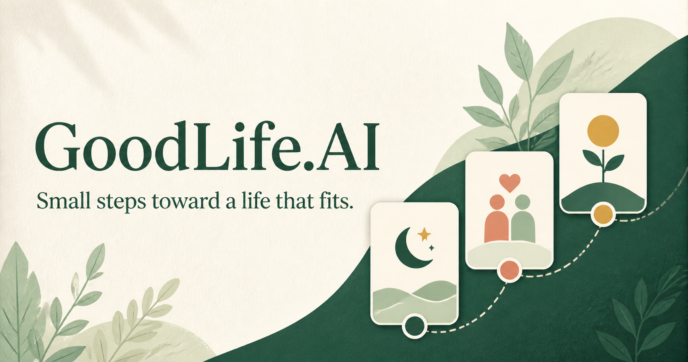
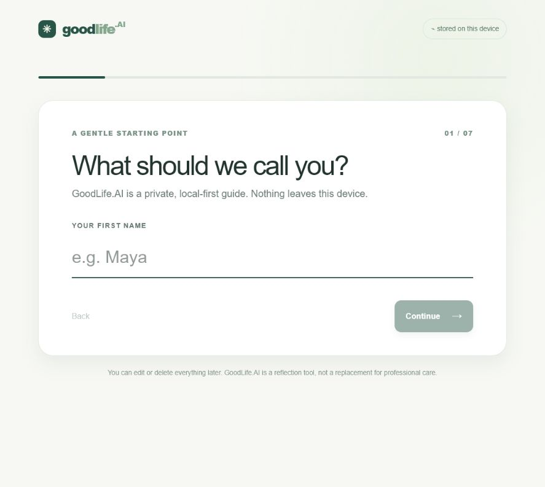
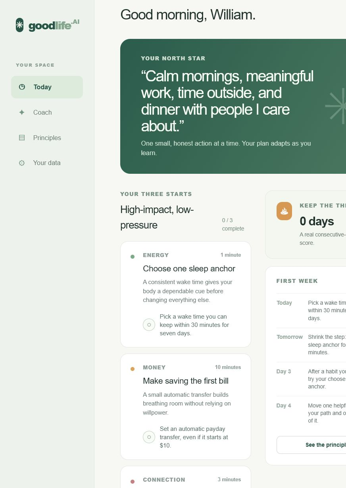
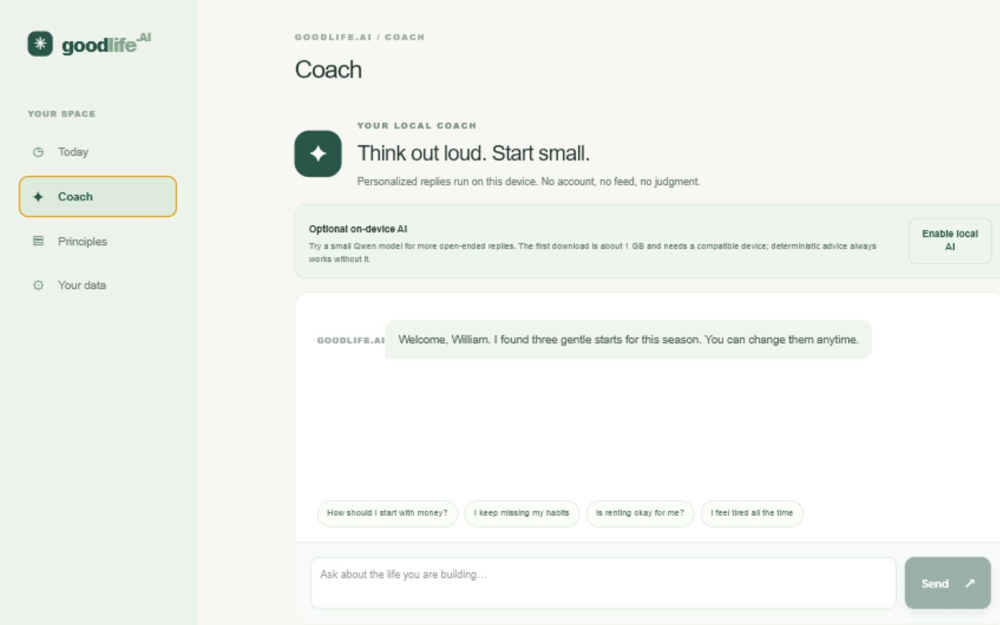

# GoodLife.AI

  

  <strong>A private, local-first coach for building a life that fits.</strong> 
  GoodLife.AI turns a few honest answers into small steps I can actually try.

  <a href="https://goodlifeai.vercel.app">Try the live app</a>
  ·
  <a href="https://github.com/mutms7/GoodLife.AI">View the repository</a>
  ·
  <a href="https://william-chenyin.vercel.app">See it on my portfolio</a>

## Why I built it

I kept running into the same problem in conversations about self-improvement. People usually don't need another giant list of things to fix. They need help deciding what to do first, and they need the first step to be small enough that they can do it on a normal Tuesday.

I built GoodLife.AI around that idea. It starts by asking what kind of life someone wants, what their current season feels like, and where things are stuck. Then it suggests three practical starting points. The goal isn't to turn life into a dashboard. It's to give someone a little more direction and a way to return tomorrow.

The financial side comes from a lesson I took from The Wealthy Barber: pay yourself first, automate saving, live below your means, and give long-term investing a place in the plan. GoodLife.AI turns that into general education about emergency savings, expensive debt, and diversified, low-cost ETFs. It doesn't promise returns or tell anyone what to buy.

## A quick tour

  

First run is a three-step conversation rather than a form. You describe an ordinary good day, pick up to three things that matter right now, and say how honest-to-goodness fine or rough four areas are. Three is a hard cap, because everything can't be first.

  

The coach thread is the home screen, and the day's plan arrives inside it as a message you check off. The app ranks three starting actions from those answers: rough areas first, then what you said matters. Someone with rough sleep, rough money, and energy on their list gets a wake-time anchor, a payday transfer, and a daylight walk. You can argue with any of it in the same thread.

  

The model is optional. The app works without it, you just get the fixed guidance instead of open conversation. Either way, every coach reply carries a note saying where the answer came from, and that note is a designed part of the interface rather than debug output.

## How the AI part works

GoodLife.AI uses a hybrid design. The questionnaire and the first-week plan are deterministic TypeScript logic. That makes the most visible recommendations predictable and easy to test.

The optional conversational layer uses a pretrained Qwen2.5-0.5B-Instruct-q4f16_1-MLC model through WebLLM. It has roughly 500 million parameters. The model is quantized, which keeps the download and memory requirements lower than a full-size model. The first download is about 1 GB and needs a browser with WebGPU.

The model runs on the user's device inside the browser. There is no GoodLife.AI inference server, no API key, and no per-message cloud request. I didn't train or fine-tune this model. I integrated it and built the product logic around it.

Before a chat message is handled, a small domain classifier checks whether it is about crisis support, money, health, housing, habits, relationships, meaning, or a general question.

- General questions, habits, relationships, and meaning can use the local SLM.
- Money, health, and housing stay on controlled deterministic guidance.
- Crisis language receives a crisis-support response instead of model-generated coaching.
- If the model can't load or generation fails, the deterministic coach answers instead.

The SLM prompt currently receives the user's description of a good day for lower-risk conversation. The rest of the answers stay with the deterministic planner. That boundary is intentional, and it's also an honest description of what the app does today.

Replies stream token by token, and if the model is off, unsupported or fails mid-generation, the deterministic coach answers and the note says exactly that.

## The ideas behind the product

GoodLife.AI borrows ideas, not slogans.

Atomic Habits shaped the seven-day plan. Actions are made smaller, tied to cues that already exist, supported by the environment, and tracked without treating a missed day as a personal failure. The app uses a simple “never miss twice” reminder.

The Wealthy Barber shaped the money prompts. Pay yourself first, automate a sustainable amount, keep an emergency buffer, deal with high-interest debt, and invest for the long term only after considering risk, time horizon, account rules, fees, and local tax context.

Other cards in the library are informed by How to Win Friends and Influence People, The Happiness Trap, Why We Sleep, and Four Thousand Weeks. I also link to public guidance from the CDC, WHO, Investor.gov, and the Consumer Financial Protection Bureau. These are prompts to test, not rules to obey.

## Architecture

~~~mermaid
flowchart TD
    A[Onboarding questionnaire] --> B[Local profile in browser storage]
    B --> C[Deterministic planner]
    C --> D[Three starting actions]
    D --> E[Seven-day habit plan]
    B --> F[Coach message]
    F --> G[Domain classifier]
    G -->|General habits relationships meaning| H[Optional Qwen 0.5B SLM]
    G -->|Money health housing| I[Controlled advice]
    G -->|Crisis language| J[Crisis support response]
    H --> K[Local chat response]
    H -->|Unavailable or error| I
    I --> K
    J --> K
    K --> L[Local chat history and progress]
~~~

## Privacy and limits

The profile, completions, streaks, and chat history are stored in the browser's local storage. They aren't sent to a GoodLife.AI server. The optional model runs locally after its files are downloaded and cached by the browser.

This also means the data is tied to that browser and device. Clearing site data can remove it, so the app includes a JSON export. The model needs a compatible WebGPU device and a fairly large first download. Small local models can be less capable than cloud models, especially with complex or nuanced questions.

GoodLife.AI is a reflection and education tool. It isn't medical, mental-health, legal, or financial advice. Investment returns aren't guaranteed. Renting and owning both have trade-offs, and the app doesn't assume one is right for everyone. For urgent safety concerns, contact local emergency services or a crisis service in your area.

## Tech stack

- React and TypeScript
- Vinext and Vite
- The Organic design system, self-hosted Caprasimo and Figtree
- WebLLM with Qwen2.5-0.5B-Instruct
- WebGPU for in-browser inference
- Browser local storage for the local-first data model
- Service worker and web manifest for PWA installation
- Node's built-in test runner, ESLint, and TypeScript checks

## Run it locally

I use Node.js >=22.13.0.

~~~bash
git clone https://github.com/mutms7/GoodLife.AI.git
cd GoodLife.AI
npm install
npm run dev
~~~

Then open the local URL printed by Vinext. `/` is the marketing page, with a coach demo you can talk to before committing to anything, and `/app` is the product. First run and the deterministic coach work right away. To try the SLM, open Your data in a WebGPU-compatible browser and choose “Download the model.” The download happens once per browser profile and can take a while.

To make a production build:

~~~bash
npm run build
npm start
~~~

## Tests and checks

~~~bash
npm test
npm run lint
npm run build
~~~

The tests cover the server-rendered marketing page, the removal of the old dashboard, advice-domain routing, the routing notes, high-risk deterministic paths, and how the day's three get ranked.

## Install it as an app

GoodLife.AI is a Progressive Web App. On a supported browser, use the install prompt in the app or the browser's “Add to Home Screen” or “Install” command. The service worker caches the application shell so it opens like a standalone app after the first visit. The local model still needs its initial download before it can answer.

## Resume and interview summary

I built GoodLife.AI, a local-first AI life coach with React and TypeScript. It converts a user questionnaire into a deterministic three-action plan and a seven-day habit sequence, then adds optional on-device Qwen 0.5B chat through WebLLM and WebGPU. I designed domain-aware routing so money, health, housing, and crisis messages stay on controlled responses, with a deterministic fallback when the SLM is unavailable. The app is installable as a PWA, stores personal data locally, and runs without an API key.

The part I'd talk about in an interview is the boundary between the model and the product logic. I didn't claim that a small model could safely handle every kind of life advice. I used it where open-ended conversation helps, and kept high-risk guidance predictable and reviewable.
