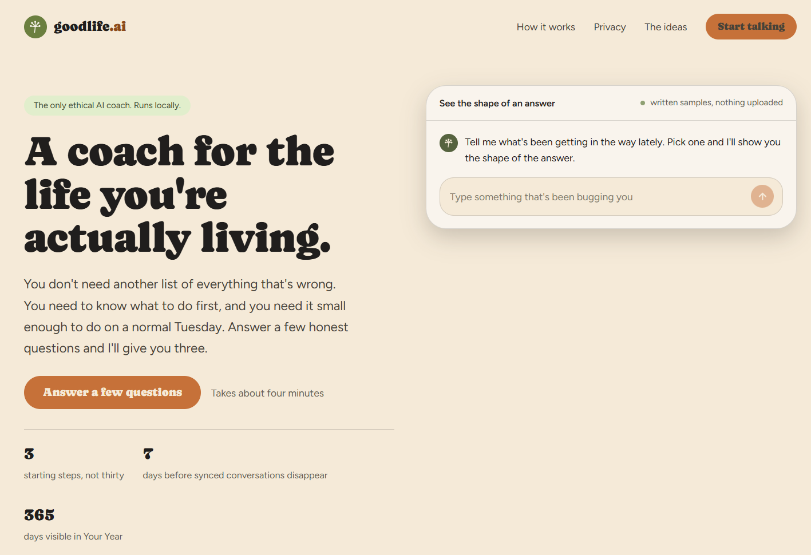
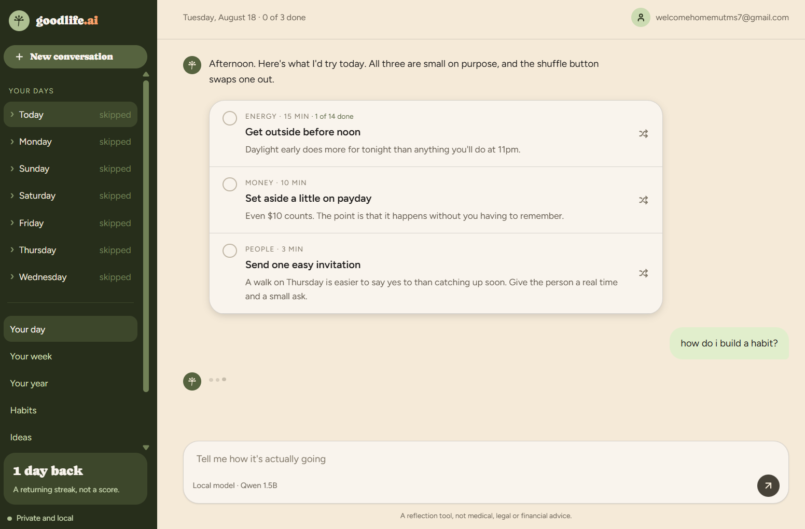

# GoodLife.AI

## Download (Recommended)

[Download the latest Windows installer](https://github.com/mutms7/GoodLife.AI/releases/latest/download/GoodLife.AI-Setup.exe) (`GoodLife.AI-Setup.exe`). The installer includes the local coach and can run offline after setup.

## Website

[Open GoodLife.AI in your browser](https://goodlifeai.vercel.app/).

GoodLife.AI is **the only ethical AI coach**: the AI runs locally on your computer or phone. Only the account information you choose to sync is stored online, and conversations disappear after seven days.

GoodLife.AI grew out of notes from *The Defining Decade*, *Atomic Habits*, and *The Wealthy Barber*. It turns a few honest answers into three steps for today, then tracks whether you did them.

It is a reflection and education tool, not medical, legal, mental-health, or financial advice.

## Privacy and limits

The coach model runs on your device after a one-time browser download, or directly from the bundled Windows app. Your local profile, progress, and chat stay on the device unless you choose to sync account information. Synced conversations are deleted after seven days.

Conversation needs a WebGPU-compatible browser and the model download. Without it, the planner still works but chat is unavailable.

## Run locally

Requires Node.js >=22.13.0.

~~~bash
git clone https://github.com/mutms7/GoodLife.AI.git
cd GoodLife.AI
npm install
npm run dev
~~~

Open the local URL printed by Vinext. Edit [`lib/playbook.md`](lib/playbook.md) to change coaching guidance.

## Build and checks

~~~bash
npm test
npm run lint
npm run build
~~~

For a production server:

~~~bash
npm run build
npm start
~~~

## Share cards

The link previews are static PNGs in `public/`, rendered from the card markup in [`scripts/og-cards.mjs`](scripts/og-cards.mjs). Regenerate them after a copy change or a colour-token change:

~~~bash
npm run og:render
~~~

That drives whatever Chromium is already installed, at 2x; set `CHROME_PATH` to pick a specific binary. Ship a replacement under a new `.vN` filename rather than overwriting a card, because Twitter, Slack, iMessage, and LinkedIn all cache these for days.

## Windows release

The Windows installer bundles the local model. To build it locally (the model is roughly 1.6 GB):

~~~bash
npm run desktop:fetch-model
npm run desktop:package
~~~

Pushes to `main` test, package, and publish the latest installer to GitHub Releases.
